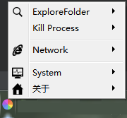
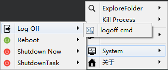

  

# BatchRunTrayTool

A tool for run any programs or files in windows system, it's a combination of quick links.

Software running shotcut :

After installed, you can open folder "__config-simple__" under .exe position to learn what is a simple config. You can put any files, quick links under __config__ folder, and this software will help you start them quickly by just one or two mouse click.

了解__config-simple__是什么回事后，打开__config__可以了解更多的配置技巧。

1. **\_\_logo\_\_.png**是文件夹图标。
2. **程序\_\_logo\_\_.png**是程序的图标。（大部分程序有自己的图标）
3. **程序\_\_show\_\_**强调程序以可见方式运行，对于.bat脚本可以看到命令行界面。
4. **文件夹\_\_seperator\_\_**使得菜单产生分隔符。

## License

Copyright (c) BrightGuo.com. All rights reserved.

Licensed under the [MIT](LICENSE.txt) License.
